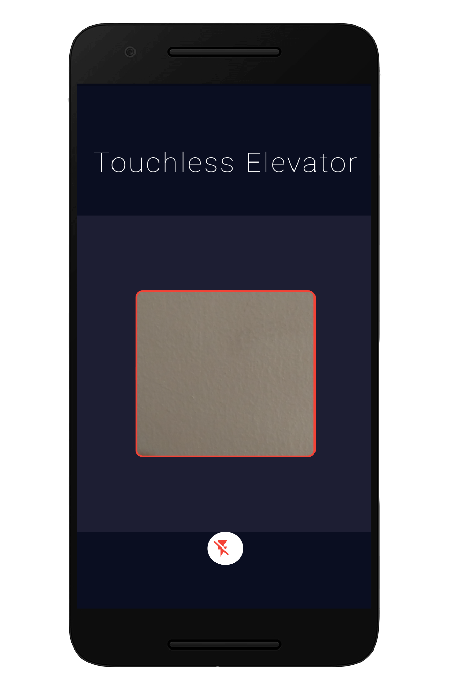
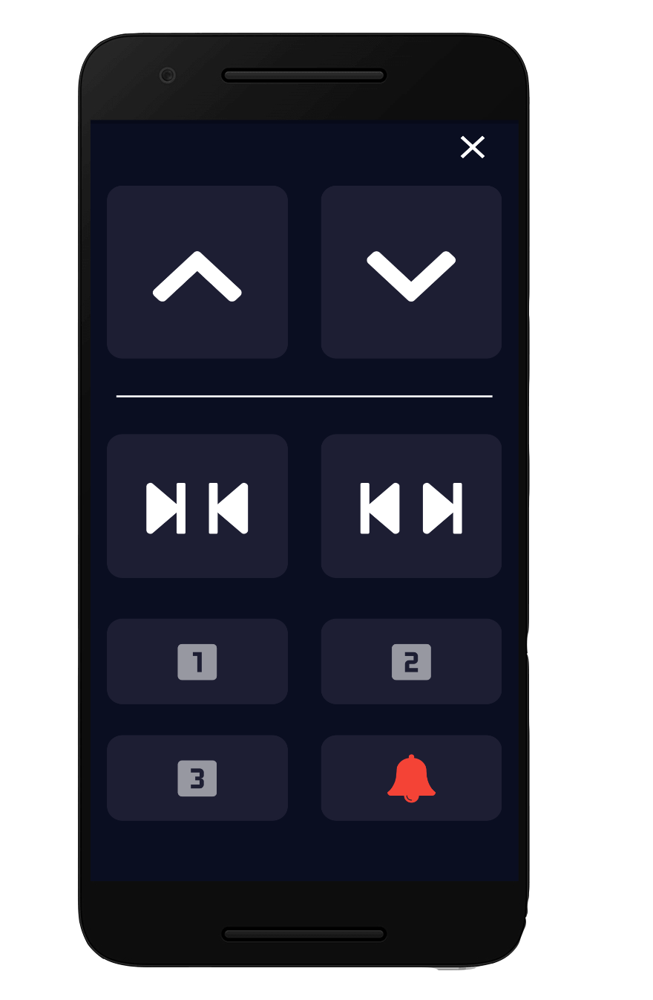

## **IOT Based Touchless Elevator**
Android Application created for SLIoT Competition 2020.

An application for the passengers using elevators, designed to avoid touching the virus contaminated surfaces on elevator buttons for the issue rose with COVID pandemic. A Flutter application that is integrated with a QR code scanner for the authentication and using MQTT protocol for the communication with elevator controlling.

### Screenshots

&nbsp;

### How it works⚙️

